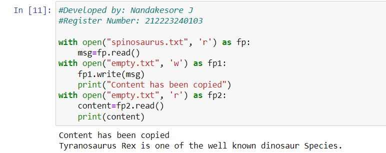

# Copy-File
## AIM:
To write a python program for copying the contents from one file to another file.
## EQUIPEMENT'S REQUIRED: 
PC
Anaconda - Python 3.7
## ALGORITHM: 
### Step 1:
Open the file1 using open() in read mode.
### Step 2: 
Copy the content present using read().
### Step 3: 
Open the file2 using read() in write mode.
### Step 4:  
Write the content copied from file1 using write(),
### Step 5: 
Print the content using print().
### Step 6: 
Close the file using close().[Not Mandatory]
## PROGRAM:
```
#Developed by: Nandakesore J
#Register Number: 212223240103

with open("spinosaurus.txt", 'r') as fp:
    msg=fp.read()
with open("empty.txt", 'w') as fp1:
    fp1.write(msg)
    print("Content has been copied")
with open("empty.txt", 'r') as fp2:
    content=fp2.read()
    print(content)
```

### OUTPUT:



## RESULT:
Thus the program is written to copy the contents from one file to another file.
